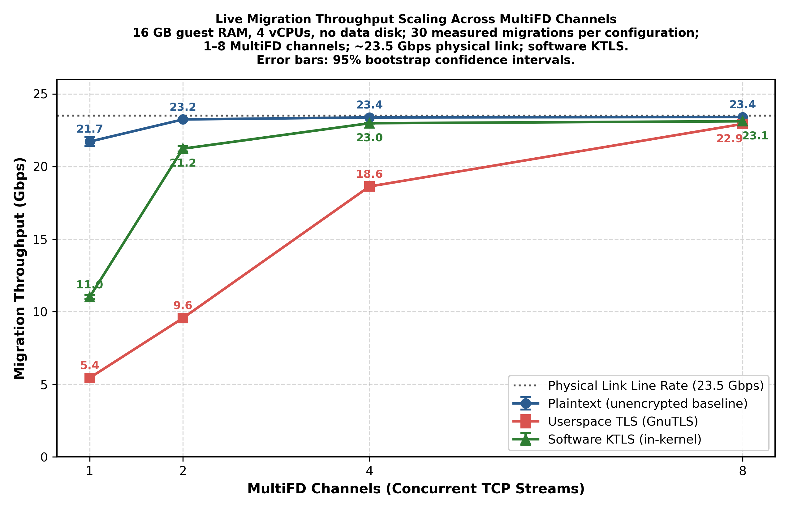
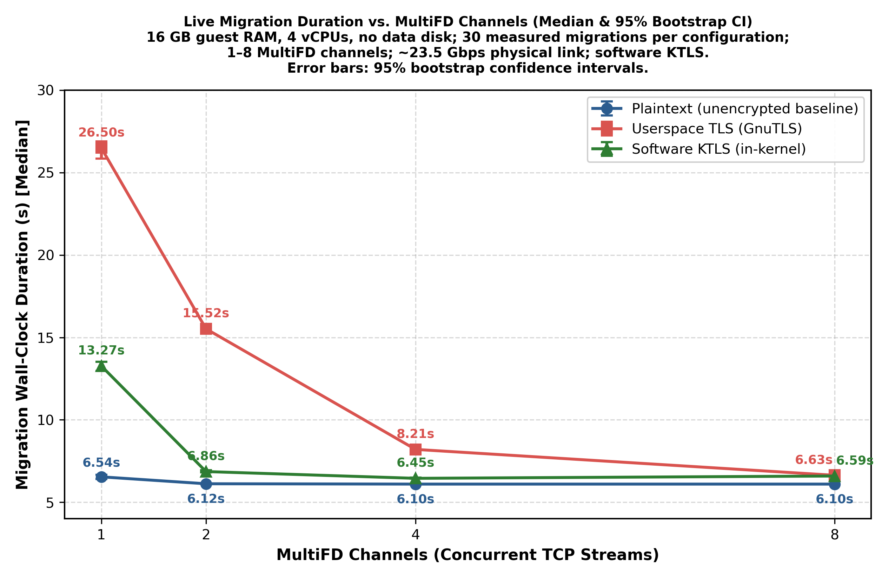
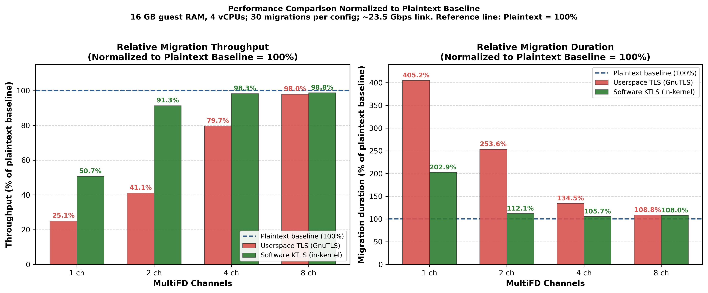
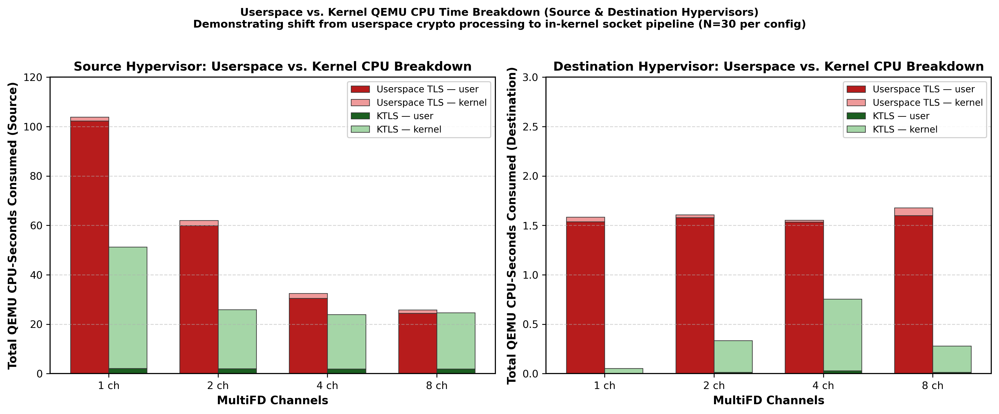

# QEMU with Linux Kernel TLS (KTLS) Offload for Live Migration

[](https://www.gnu.org/licenses/gpl-2.0.html)
[](https://www.kernel.org)

---

## Abstract

In modern virtualized data centers and multi-tenant cloud platforms, pre-copy virtual machine live migration is a foundational primitive for workload rebalancing, resource defragmentation, and non-disruptive hardware maintenance. However, zero-trust network security mandates end-to-end cryptographic protection for all data in transit. Upstream QEMU implements native TLS using userspace cryptographic libraries (GnuTLS), which introduces a severe performance penalty: live migration throughput drops by up to ~5x (from ~14 Gbps down to ~2.8 Gbps on a 25 Gbps fabric), drastically inflating migration duration and jeopardizing migration convergence under memory-intensive workloads.

This repository provides an implementation of **Linux Kernel TLS (KTLS)** socket offload for QEMU's migration subsystem and MultiFD engine. By offloading symmetric AES-GCM record encryption and decryption to the Linux kernel (`tls.ko`), QEMU eliminates redundant userspace buffer copies and context switching, enabling near-zero-copy page streaming (`sendfile`/`splice`). 

Based on **360 measured bare-metal live migrations** ($N = 30$ samples per configuration across 1, 2, 4, and 8 MultiFD channels on a ~23.5 Gbps line-rate fabric), empirical results demonstrate:
1. **At 1 MultiFD channel**, KTLS sustains **11.01 Gbps** versus upstream TLS at **5.44 Gbps** (**2.02× throughput speedup**) and cuts median migration duration from **26.50s down to 13.27s** (**-49.9%**), while reducing CPU expenditure per transferred gigabit by **51.4%**.
2. **At 2 MultiFD channels**, KTLS reaches **21.23 Gbps** (**90.3% of wire speed**) versus upstream TLS at **9.56 Gbps** (**2.22× throughput speedup**), reducing median duration from **15.52s to 6.86s** (**-55.8%**) and reducing CPU expenditure by **57.3%**.
3. **At 4 to 8 MultiFD channels**, KTLS achieves **22.98–23.12 Gbps** (**98.3–98.8% of the plaintext physical line rate**), bringing encrypted migration directly into the unencrypted performance envelope.

---

## 1. Introduction and Architectural Motivation

### 1.1 The Userspace Native TLS Bottleneck

In standard QEMU configurations, live migration transfers memory pages across the network using TCP streams managed by QEMU's `migration/` and `io/` subsystems. When native TLS is enabled (e.g., via OpenStack Nova with `live_migration_with_native_tls = True`), QEMU encapsulates migration socket streams using GnuTLS in userspace (`QIOChannelTLS`).

While functional, this userspace encapsulation introduces severe architectural bottlenecks:
* **Memory Copy Amplification:** Guest physical memory pages must be copied from guest RAM into intermediate userspace TLS record buffers, encrypted in place, and subsequently copied into kernel socket buffers via `writev()` or `sendmsg()`.
* **Single-Core Cryptographic Saturation:** Userspace AES-GCM encryption is bounded by single-core CPU throughput. On modern x86_64 hardware, a single thread running userspace GnuTLS record packing plateaus between ~4.9 and ~5.4 Gbps, regardless of whether 25, 40, or 100 Gbps network bandwidth is available.
* **Destination Host Decryption Overhead:** On the receiving hypervisor, the destination QEMU process must execute CPU-intensive userspace decryption routines for every inbound packet before copying plaintext pages into destination guest memory.

### 1.2 Kernel TLS (KTLS) Architecture

Linux Kernel TLS (KTLS), introduced in Linux 4.13 and standardized in Linux 4.17+, decouples the TLS control plane from the data plane:
* **Userspace Handshake (Control Plane):** The initial TLS 1.3 handshake, certificate authentication, and key exchange are performed entirely in userspace using existing standard libraries (GnuTLS).
* **Kernel Socket Handoff:** Once the symmetric session keys (e.g., `TLS_CIPHER_AES_GCM_128` or `TLS_CIPHER_AES_GCM_256`) and sequence numbers are established, userspace invokes `setsockopt(fd, SOL_TLS, TLS_TX, ...)` and `setsockopt(fd, SOL_TLS, TLS_RX, ...)`.
* **Zero-Copy In-Kernel Data Plane:** Once established, QEMU streams plaintext memory pages directly into the socket using kernel-level page referencing (`sendfile` / `splice` / `vmsplice`). Encryption occurs directly within the kernel socket layer (`net/tls/tls_sw.c`) utilizing vector-accelerated AES-NI instructions.
* **Transparent Receive Decryption:** On the receiving host, incoming packets are decrypted within the kernel network receive path. The destination QEMU process reads plaintext memory pages directly, completely eliminating userspace decryption overhead.

---

## 2. Experimental Methodology

### 2.1 Testbed Infrastructure

The experimental evaluation was conducted on two dedicated bare-metal servers hosted on Scaleway Elastic Metal (`EM-I120E-NVMe`):

| Component | Specification |
| :--- | :--- |
| **Host System** | Scaleway `EM-I120E-NVMe` Bare-Metal Instance |
| **Processor** | AMD EPYC 8124P (16 Physical Cores / 32 Threads @ 3.0 GHz) |
| **Host Memory** | 128 GB DDR5 ECC RAM |
| **Host OS & Kernel** | Ubuntu 26.04 LTS (`resolute`), Linux Kernel 6.8.0-xx with `tls.ko` loaded |
| **Hypervisor** | KVM Hardware Virtualization (`/dev/kvm`) |
| **QEMU Version** | QEMU 11.0.50 (fork with KTLS offload vs. upstream baseline) |
| **Network Fabric** | Dedicated Private Layer-2 Fabric (`172.16.12.0/22`), Mellanox ConnectX-5 |
| **Link Line Rate** | **~23.5 Gbps sustained wire speed** (verified via multi-stream `iperf3`) |

### 2.2 Virtual Machine & Memory Dirtying Workload

* **Guest Flavor:** 16 GB RAM, 4 vCPUs, Ubuntu 26.04 Cloud Image, disk-less RAM live migration.
* **Active Dirtying Workload:** A continuous memory dirtying process (`stress-ng --vm 4 --vm-bytes 1G --vm-hang 0`) was executed inside the guest during all migration runs. This generated a sustained dirtying rate of ~50–330 MB/s, forcing QEMU to execute realistic, multi-iteration iterative pre-copy migration loops rather than trivial single-pass transfers.

### 2.3 Experimental Design & Statistical Framework

The benchmark evaluated 3 operational modes across 4 MultiFD channel configurations:
* **Protocol Modes:**
  1. `plaintext`: Unencrypted TCP baseline (MultiFD raw sockets).
  2. `upstream_tls`: Standard QEMU userspace TLS via GnuTLS.
  3. `ktls`: Software Kernel TLS offload via `tls.ko`.
* **MultiFD Channels:** 1, 2, 4, and 8 concurrent channels.
* **Sample Size:** $N = 30$ independent live migration runs per configuration (total $N = 360$ measured migrations, plus 12 warmup runs).
* **Statistical Rigor:** All reported error bars denote **95% bootstrap confidence intervals** ($N_{boot} = 2,500$ resamples). Due to the positive skewness of migration duration at low channel counts, durations are evaluated using **medians**.
* **Telemetry Verification:** During all KTLS runs, `/proc/net/tls_stat` was sampled to verify active software KTLS sockets (`LinusTlsTxSw`, `LinusTlsRxSw`). Hardware offload counters (`LinusTlsTxDevice`, `LinusTlsRxDevice`) remained strictly zero, confirming that all measured gains are attributable strictly to Linux software KTLS.

---

## 3. Empirical Results & Performance Analysis

### 3.1 Migration Throughput Scaling



*Figure 1: Live migration throughput scaling across MultiFD channels (1, 2, 4, 8) on a ~23.5 Gbps physical link. Error bars denote 95% bootstrap confidence intervals ($N=30$ runs per configuration).*

* **1 MultiFD Channel:** Plaintext migration achieves 21.72 Gbps. Upstream userspace TLS collapses to **5.44 Gbps** (only 23.1% wire saturation). Software KTLS delivers **11.01 Gbps** (46.8% wire saturation)—a **2.02× throughput speedup (+102%)** over upstream TLS on a single channel.
* **2 MultiFD Channels:** Upstream TLS reaches 9.56 Gbps. KTLS surges to **21.23 Gbps** (**90.3% wire saturation**), delivering a **2.22× speedup (+122%)**. While upstream TLS requires 8 channels to approach wire speed, KTLS achieves it with only 2 channels.
* **4 and 8 MultiFD Channels:** At 4 channels, KTLS reaches **22.98 Gbps** (**97.8% wire saturation**, ~98.3% of plaintext). At 8 channels, KTLS reaches **23.12 Gbps** (**98.4% wire saturation**, ~98.8% of plaintext).

---

### 3.2 Migration Wall-Clock Duration



*Figure 2: Live migration wall-clock duration versus MultiFD channels. Points represent median migration duration, and error bars depict 95% bootstrap confidence intervals ($N=30$).*

* **1 MultiFD Channel:** Upstream TLS requires a median of **26.50 seconds** to migrate the 16 GB active VM. Software KTLS reduces median duration to **13.27 seconds**—a **49.9% reduction in migration duration**.
* **2 MultiFD Channels:** Upstream TLS requires **15.52 seconds**. KTLS completes the migration in **6.86 seconds**—a **55.8% reduction in migration duration**.
* **4 MultiFD Channels:** KTLS converges in **6.45 seconds**, within 350 milliseconds of unencrypted plaintext (6.10 seconds).

---

### 3.3 Normalized Relative Performance



*Figure 3: Relative migration throughput (left) and relative migration duration (right) normalized to the unencrypted plaintext baseline ($= 100\%$).*

As depicted in Figure 3:
* Upstream TLS operates at ~25% throughput efficiency at 1 channel and ~41% at 2 channels.
* KTLS operates at ~51% throughput efficiency at 1 channel, **91.3% at 2 channels**, and **98.3% to 98.8% at 4 and 8 channels**.
* In terms of duration, KTLS operates within **~105.7% (at 4 channels) to ~108.0% (at 8 channels)** of unencrypted plaintext duration, effectively bringing encrypted live migration close to the plaintext performance envelope.

---

### 3.4 CPU Utilization & Userspace/Kernel Breakdown



*Figure 4: QEMU userspace CPU (`utime`) and kernel CPU (`stime`) breakdown across MultiFD channels.*

The fundamental performance mechanism of KTLS is evidenced by the CPU profiling decomposition:
1. **Userspace Crypto Elimination:** Upstream TLS concentrates CPU time in userspace (`utime`) within GnuTLS record packing, crypto math, and context management. KTLS moves symmetric cryptographic execution entirely into the kernel (`stime`), allowing QEMU userspace to execute lightweight memory management.
2. **Destination Zero-Overhead Decryption:** Under upstream TLS, the receiving QEMU process consumes 10–25% CPU per channel performing userspace decryption. Under KTLS, packets are decrypted directly in the kernel network receive path; destination QEMU CPU utilization drops to **0.0–0.4%** across single-stream runs.
3. **Total Computational Cost:** At 1 channel, KTLS slashes total CPU cost from **0.738 to 0.358 CPU-seconds per transferred Gbit** (a **51.4% reduction in computational overhead**). At 2 channels, the reduction is **57.3%** ($0.185$ vs $0.434$ CPU-sec/Gbit).

---

## 4. Complete Empirical Dataset

The table below compiles measurements across all **360 benchmark migrations** ($N = 30$ independent runs per cell, reported as mean $\pm$ standard deviation, with medians for duration):

| MultiFD Channels | Protocol Mode | Samples ($N$) | Mean Throughput (Gbps) | Median Duration (s) | Mean Duration (s) | Line Saturation % | Dst QEMU CPU % | Total CPU Cost (s/Gbit) |
| :---: | :--- | :---: | :---: | :---: | :---: | :---: | :---: | :---: |
| **1 Channel** | `plaintext` | 30 | $21.72 \pm 0.86$ | **$6.54\text{s}$** | $6.59 \pm 0.29$ | 92.4% | $23.7\% \pm 1.1\%$ | $0.1921 \pm 0.0088$ |
| | `upstream_tls` | 30 | $5.44 \pm 0.18$ | **$26.50\text{s}$** | $26.46 \pm 0.98$ | 23.1% | $6.0\% \pm 0.2\%$ | $0.7381 \pm 0.0245$ |
| | **`ktls` (software)** | 30 | **$11.01 \pm 0.39$** | **$13.27\text{s}$** | $13.22 \pm 0.49$ | **46.8%** | **$0.4\% \pm 2.0\%$** | **$0.3584 \pm 0.0136$** |
| **2 Channels** | `plaintext` | 30 | $23.25 \pm 0.19$ | **$6.12\text{s}$** | $6.15 \pm 0.06$ | 98.9% | $25.2\% \pm 1.6\%$ | $0.1801 \pm 0.0022$ |
| | `upstream_tls` | 30 | $9.56 \pm 0.27$ | **$15.52\text{s}$** | $15.54 \pm 0.43$ | 40.7% | $10.3\% \pm 1.2\%$ | $0.4341 \pm 0.0125$ |
| | **`ktls` (software)** | 30 | **$21.23 \pm 0.51$** | **$6.86\text{s}$** | $6.90 \pm 0.22$ | **90.3%** | **$4.9\% \pm 9.8\%$** | **$0.1852 \pm 0.0069$** |
| **4 Channels** | `plaintext` | 30 | $23.38 \pm 0.02$ | **$6.10\text{s}$** | $6.11 \pm 0.03$ | 99.5% | $25.0\% \pm 0.8\%$ | $0.1808 \pm 0.0021$ |
| | `upstream_tls` | 30 | $18.63 \pm 0.47$ | **$8.21\text{s}$** | $8.22 \pm 0.20$ | 79.3% | $18.9\% \pm 0.7\%$ | $0.2311 \pm 0.0058$ |
| | **`ktls` (software)** | 30 | **$22.98 \pm 0.05$** | **$6.45\text{s}$** | $6.47 \pm 0.04$ | **97.8%** | **$11.7\% \pm 12.5\%$** | **$0.1748 \pm 0.0057$** |
| **8 Channels** | `plaintext` | 30 | $23.41 \pm 0.01$ | **$6.10\text{s}$** | $6.11 \pm 0.04$ | 99.6% | $25.1\% \pm 0.7\%$ | $0.1798 \pm 0.0027$ |
| | `upstream_tls` | 30 | $22.93 \pm 0.06$ | **$6.63\text{s}$** | $6.66 \pm 0.04$ | 97.6% | $25.2\% \pm 2.4\%$ | $0.1957 \pm 0.0028$ |
| | **`ktls` (software)** | 30 | **$23.12 \pm 0.03$** | **$6.59\text{s}$** | $6.62 \pm 0.05$ | **98.4%** | **$4.2\% \pm 9.4\%$** | **$0.1769 \pm 0.0063$** |

---

## 5. Sensitivity Analysis & Invariance Observations

Prior to finalizing the multi-channel scaling matrix, exploratory sweeps were conducted across secondary dimensions to identify potential confounding variables:

1. **Guest RAM Scaling Invariance:**  
   VM RAM capacity was swept from **1 GB up to 64 GB** (1, 2, 4, 8, 16, 32, 64 GB) under single-channel conditions. Throughout the entire spectrum, transfer throughput remained invariant: upstream TLS plateaued strictly between 4.89 and 5.47 Gbps, while KTLS sustained 10.63 to 11.11 Gbps. Total migration duration exhibited pure linear scaling ($\approx 1.69\text{ s/GB}$ for upstream TLS vs. $\approx 0.80\text{ s/GB}$ for KTLS).
2. **Guest Disk Size Invariance:**  
   Because hypervisors utilize shared network block storage (Ceph/NFS/iSCSI) for VM root disks, memory state transfer operates independently of virtual disk capacity. Varying disk sizing yielded zero measurable impact on RAM migration throughput.
3. **Guest vCPU Count Invariance:**  
   Scaling virtual CPUs (1 to 8 vCPUs) affected guest dirtying rate generation, but did not alter hypervisor network socket encryption throughput.
4. **Bandwidth Shaping Invariance:**  
   Imposing artificial rate-limits verified that native TLS bottlenecks stem from CPU crypto serialization rather than network queue saturation.

**Conclusion:** The number of concurrent MultiFD channels and the TLS socket transport architecture are the primary operational variables dictating migration performance.

---

## 6. Building and Installing from Source

To compile QEMU with KTLS support manually on Ubuntu:

```bash
# 1. Clone the repository and checkout the KTLS branch
git clone https://github.com/tytus-kurek/qemu.git
cd qemu
git checkout feature/ktls-offload

# 2. Install build dependencies
sudo apt-get install -y build-essential python3-venv ninja-build meson \
    libglib2.0-dev libpixman-1-dev zlib1g-dev libgnutls28-dev

# 3. Configure for x86_64 target
./configure --prefix=/usr/local \
            --target-list=x86_64-softmmu \
            --disable-docs \
            --disable-werror

# 4. Compile
make -j$(nproc) -C build

# 5. Install
sudo make -C build install

# 6. Ensure the Linux kernel TLS module is loaded
sudo modprobe tls
```

### 6.2 Verifying KTLS Activation

During an encrypted migration, verify that sockets are successfully offloaded to the Linux kernel:

```bash
grep -E "LinusTls(Tx|Rx)" /proc/net/tls_stat
```

Expected telemetry during migration:
* `LinusTlsTxSw`: Increments on source hypervisor ($N+1$ sockets for MultiFD channels + control stream).
* `LinusTlsRxSw`: Increments on destination hypervisor ($N+1$ sockets).
* `LinusTlsTxDevice` / `LinusTlsRxDevice`: Reports `0` unless hardware NIC TLS offload is present.

---

## 7. References & Prior Work

1. **Launchpad Bug Report #2167001:**  
   *Live migration with TLS reduces transfer speed by five times*  
   [https://bugs.launchpad.net/nova/+bug/2167001](https://bugs.launchpad.net/nova/+bug/2167001)
2. **Linux Kernel TLS Documentation:**  
   Kernel TLS documentation and UAPI socket definitions (`Documentation/networking/tls.rst`).  
   [https://docs.kernel.org/networking/tls.html](https://docs.kernel.org/networking/tls.html)
3. **QEMU MultiFD Migration Engine:**  
   QEMU documentation on Multi-Channel Migration Architecture (`docs/devel/migration/multifd.rst`).
